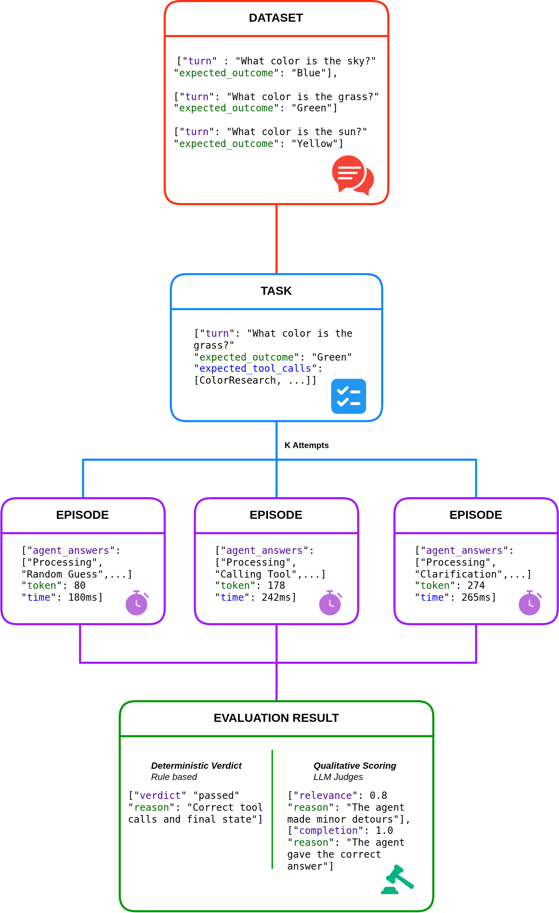

# High Level documentation of BAT-CLI

## Introduction

**BAT-CLI (BubbleRAN Agentic Toolkit CLI)** is a command-line companion to [BAT-ADK](../../adk/docs/bat-adk.md). It gives you a single entry point to **scaffold, configure, containerize, and evaluate** BAT agents, so you can move from an empty directory to a deployed, benchmarked agent without writing boilerplate.

The CLI is distributed on PyPI as `bat-cli` and exposes a single executable: `bat`.

### Design Philosophy

BAT-CLI is designed to let you focus on **agent behavior**, not on the surrounding lifecycle plumbing. It encodes the conventions of a BAT agent project (its file layout, environment variables, Docker build, and evaluation harness) into a handful of commands, so every agent looks the same and ships the same way.

The tool is built with [Typer](https://typer.tiangolo.com/) and organized as a tree of subcommands, each owning one stage of the agent lifecycle.

## Preliminary Concepts

Before using **BAT-CLI**, you should be familiar with a few core ideas:

- **BAT-ADK basics**
  Understand what an Agent Application, Agent Card (`agent.json`), and Agent Configuration (`config.yaml`) are, since the CLI generates and operates on them.

- **The agent project layout**
  A BAT agent is a Python project (managed with [uv](https://docs.astral.sh/uv/)) with a conventional structure: `agent.json`, `config.yaml`, `pyproject.toml`, a `.env`, and a `src/` package containing the graph and LLM clients.

- **A2A fundamentals**
  Know that agents expose an **A2A server** over HTTP. The evaluation engine drives an agent purely through this A2A endpoint.

## Command Tree at a Glance

The CLI is a tree of subcommands, each mapping to one lifecycle stage:

```
bat
├── init
│   └── agent
│       ├── <name>
│       ├── --clients, -c
│       ├── --output-dir, -o
│       ├── --force, -f
│       ├── --port
│       ├── --model
│       └── --model-provider
├── add
│   └── client
│       ├── <clients>
│       └── --force, -f
├── set
│   └── env
│       ├── --port
│       ├── --model
│       ├── --model-provider
│       ├── --docker-registry
│       └── --repo
├── eval
│   ├── init
│   │   └── --force, -f
│   ├── run
│   ├── show
│   └── plot
│       ├── --folder, -f
│       └── --filter, -F
├── build
│   ├── --context, -C
│   ├── --docker-registry
│   ├── --repo
│   ├── --version
│   └── --no-cache
├── push
│   ├── --context, -C
│   ├── --docker-registry
│   ├── --repo
│   └── --version
└── version
```

Each top-level branch maps to one lifecycle stage: **create** (`init`), **extend** (`add`), **configure** (`set`), **evaluate** (`eval`), and **containerize/distribute** (`build`, `push`). The standalone `version` command reports the installed toolkit version.

Built-in help is available at every level (`bat --help`, `bat eval --help`, ...). For exact flags and examples, see the [README](../README.md); this document focuses on the concepts behind each stage.

## Scaffolding (`init` / `add`)

The **scaffolding commands** generate the conventional structure of a BAT agent from templates, so every agent starts from the same well-formed baseline.

### Creating an Agent

`bat init agent <name>` produces a complete, runnable agent project: the Agent Card (`agent.json`), the Agent Configuration (`config.yaml`), a `pyproject.toml`, a `Dockerfile` and `Makefile`, a `.env`, and a `src/` package containing the **AgentGraph** and the **LLM clients**.

The command parameterizes the generated files so the new agent is ready to run:

- `--clients` pre-generates one **ChatModelClient** scaffold per name you provide.
- `--port`, `--model`, and `--model-provider` are written directly into the `.env`.

### Adding Clients Later

`bat add client <names>` adds new **ChatModelClient** scaffolds to an _existing_ agent. It must be run from the agent root (it expects `src/llm_clients/` to exist) and refuses to overwrite files unless `--force` is given.

This keeps the "one client per LLM role" pattern (e.g. `reformulator`, `planner`, `executor`) consistent whether the clients are created up front or added incrementally.

## Configuration (`set env`)

`bat set env` performs **in-place updates** to an existing agent's `.env`, without regenerating any other file. It can set the runtime values (`PORT`, `MODEL`, `MODEL_PROVIDER`) as well as the Docker defaults (`BAT_DOCKER_REGISTRY`, `BAT_DOCKER_REPO`) consumed by `build` and `push`.

It is intentionally strict: it must be run from a directory containing a `.env`, and it requires at least one value to set, so it never silently does nothing.

## Containerization (`build` / `push`)

The **build and push commands** turn an agent project into a distributable container image.

### Image Reference

Both commands resolve a single image reference of the form:

```
{registry}/{repo}:{version}
```

The `--version` is used both as the **image tag** and as a `VERSION` build argument passed into the Docker build, so the running container can report the version it was built from.

### Configuration Precedence

The registry and repository can come from several sources. The CLI resolves them in a fixed order of precedence, which lets you set sane defaults in `.env` and override them per-invocation:

1. CLI flag (`--docker-registry` / `--repo`)
2. Shell environment variable (`BAT_DOCKER_REGISTRY` / `BAT_DOCKER_REPO`)
3. The `.env` file in the current directory
4. A hardcoded fallback default

This means that once an agent's `.env` carries the Docker defaults, `bat build` and `bat push` can be run with no arguments at all.

## Evaluation Engine (`eval`)

The **evaluation engine** is the most substantial part of BAT-CLI. It runs a dataset of tasks against a live agent, judges the outcomes, and produces machine-readable artifacts and charts. It is exposed through four subcommands — `init`, `show`, `run`, and `plot` — and is implemented as a pipeline of cooperating components.



### Pipeline Overview

The diagram above shows how the engine flows from a static dataset to a judged result. Each stage corresponds to one of the components described in the sections that follow:

- **Dataset** — the full collection of tasks to evaluate. Each entry pairs a conversational `turn` with an `expected_outcome`, describing both what the agent is asked and what success looks like.
- **Task** — a single entry drawn from the dataset (a **`TaskSpec`**), enriched with its expectations: the `expected_outcome`, the `expected_tool_calls`, and the other checks the agent will be measured against.
- **Episodes (K Attempts)** — each task is run **`k`** times against the live agent. Every attempt is one **Episode** that records the agent's answers, token usage, and timing. Running multiple attempts lets the engine measure _reliability_, not just a single pass/fail.
- **Evaluation Result** — the episodes are judged along two complementary axes:
  - a **Deterministic Verdict** — rule-based, reproducible, and LLM-free (`passed` + a `reason`, e.g. _"Correct tool calls and final state"_).
  - an optional **Qualitative Scoring** — LLM judges that score dimensions such as `relevance` and `completion`, each with a free-text justification.

### Evaluation Configuration

Everything an evaluation needs is described in `eval/eval.yaml`, validated into an **`EvalConfig`** model. It declares:

- the **dataset** of tasks and the **output directory**,
- the **agent URL** plus startup/shutdown timeouts,
- **`k`** — how many attempts to run per task (for measuring reliability, not just pass/fail),
- whether **qualitative** (LLM-judge) scoring is enabled,
- the list of **models** to evaluate, and an optional **judge** model used for qualitative scoring.

`bat eval init` scaffolds this file (along with `eval/input/tasks.json` and `eval/output/`), and `bat eval show` prints the fully resolved configuration so you can confirm what will run before running it.

### Tasks and Expectations

Each entry in the dataset is a **`TaskSpec`**: an `id`, a list of conversational `turns`, and an **`TaskExpected`** block describing what success looks like. Expectations are intentionally multi-faceted:

- **`status`** — the expected final A2A task status (e.g. `completed`).
- **`output_must_contain`** — phrases that must appear verbatim in the final output.
- **`tool_calls`** — tools the agent is expected to call, matched by name and an **argument subset** (only the keys you specify must match), with a minimum call count.
- **`expected_outcome`** — a free-text description of the desired result, evaluated _semantically_ by the LLM judge rather than by string matching.

### Running an Episode

For each task and each of its `k` attempts, the engine drives the agent through the **`BatA2AAdapter`**, which speaks the A2A protocol over the configured agent URL. The adapter consumes the agent's stream and records an **`EpisodeTrace`**: the sequence of status events, token usage, timings, and the tool calls the agent made. The result of one attempt is an **`EpisodeResult`** carrying the final status, final output, and trace.

> The `bat eval run` command starts the agent itself (via `uv run .` from the agent root) and waits until the agent URL accepts connections, so the agent project must have its own dependencies installed.

### Deterministic Verdict

Once an episode completes, the **`EpisodeEvaluator`** produces a deterministic **`EpisodeVerdict`** (`passed` + a human-readable `reason`). It runs each declared expectation as an independent check — status match, each required phrase, and each expected tool call — and the episode passes only if **all** checks pass. The `reason` string concatenates every check, so a failure tells you exactly which expectation was not met.

This stage is purely rule-based and reproducible: it does not call an LLM.

### Qualitative Scoring (optional)

When `qualitative: true`, an additional **LLM-judge** pass scores each episode along several dimensions:

- **response relevance**
- **task completion quality**
- **hallucination score**
- **tool-call appropriateness**

These scores (a **`QualitativeScores`** object, including the judge's reasoning) complement the deterministic verdict with a semantic assessment of quality. The scores are based on how the LLM has been instructed and may slightly vary between run and dependes on which model is used as a judge. Scoring runs concurrently across episodes for speed.

### Artifacts

Every run writes a structured set of artifacts under the output directory:

- **`episodes/`** — one JSON file per attempt (full `EpisodeResult`, including the trace).
- **`summary.json`** — per-task pass/fail counts, success percentage across the `k` attempts, and averaged qualitative scores.
- **`metrics.json`** — aggregated metrics for the run (e.g. pass@k style summaries).

Because attempts are kept per-task and per-model, results from multiple models or runs sit side by side in the same output tree.

### Visualization (`plot`)

`bat eval plot` reads the `metrics.json` files produced by `run` and renders charts back into the output folder. Each sub-folder containing a `metrics.json` is treated as one run, so a single `plot` invocation can compare multiple models or runs. The `--filter` option narrows the _per-task_ charts to a subset of task ids, while summary charts always cover all runs.

## Version (`version`)

`bat version` prints the installed BAT-CLI version and exits. The value is read from the package metadata of the installed `bat-cli` distribution, so it always reflects the exact build in use — handy when reporting issues or confirming an upgrade. If the CLI is run from a source checkout that is not installed as a package, the command reports that the version is unavailable and exits non-zero.
